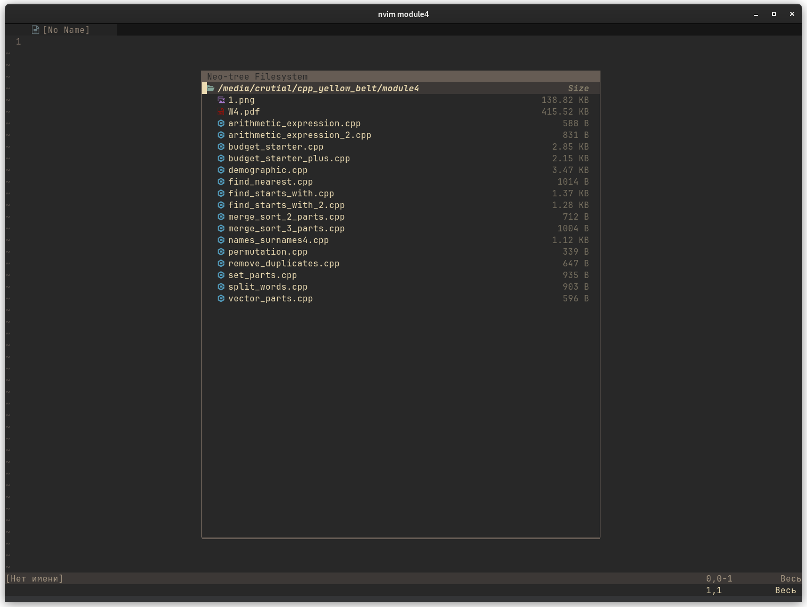
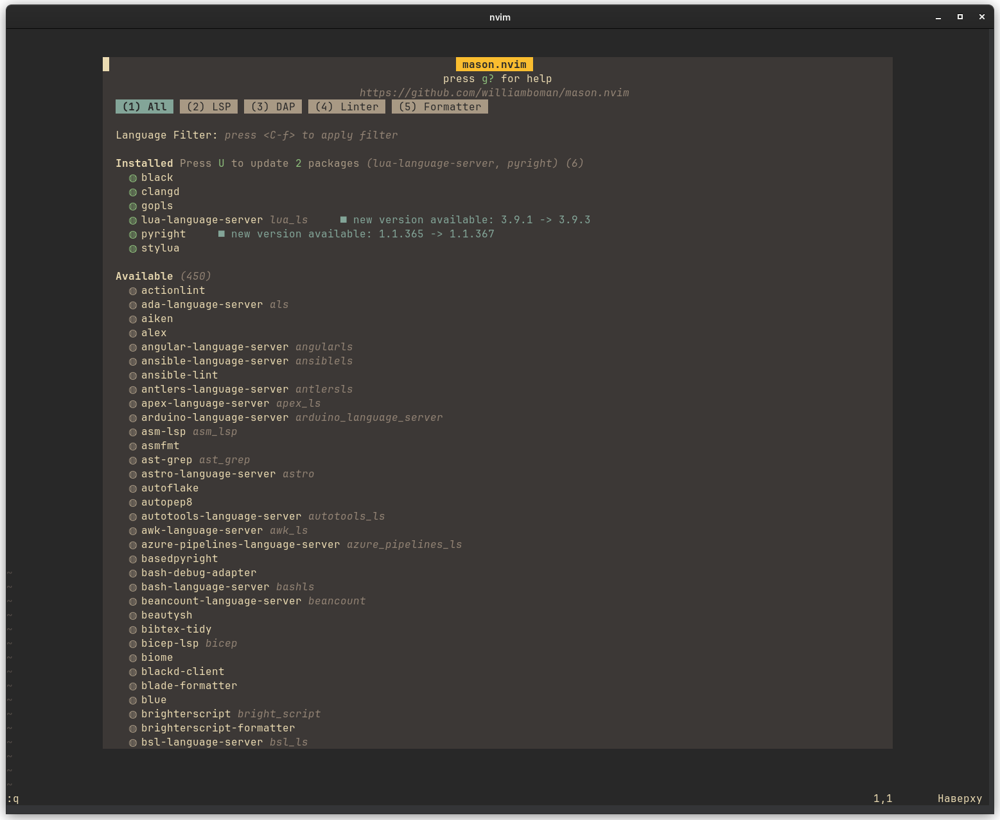
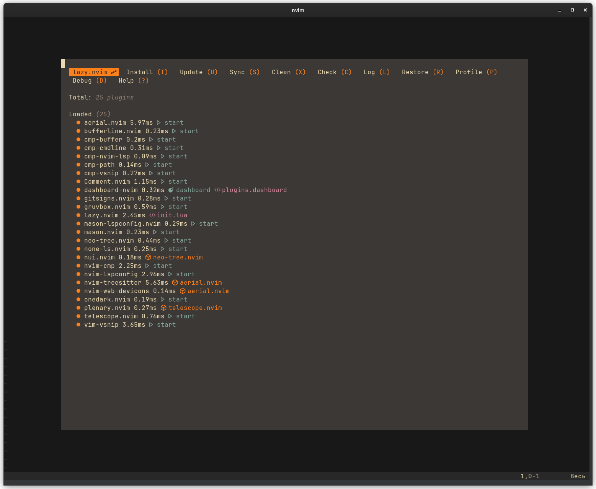
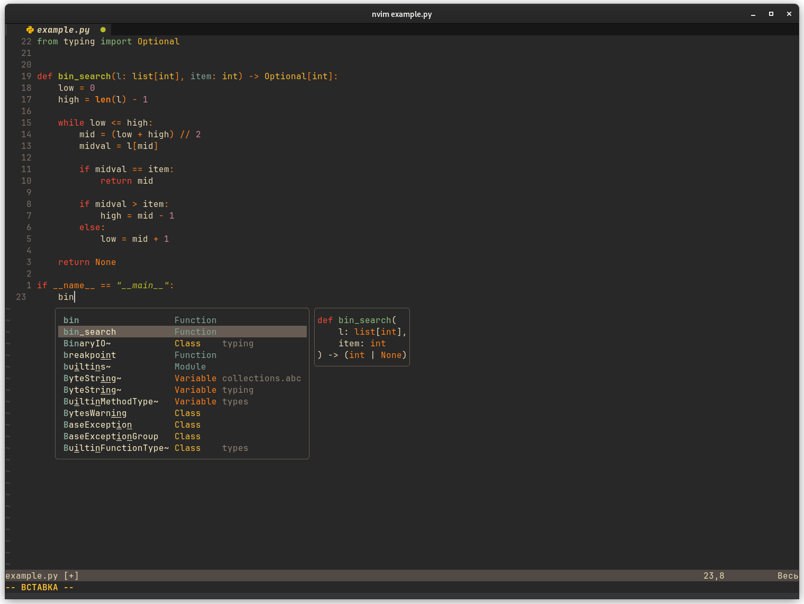
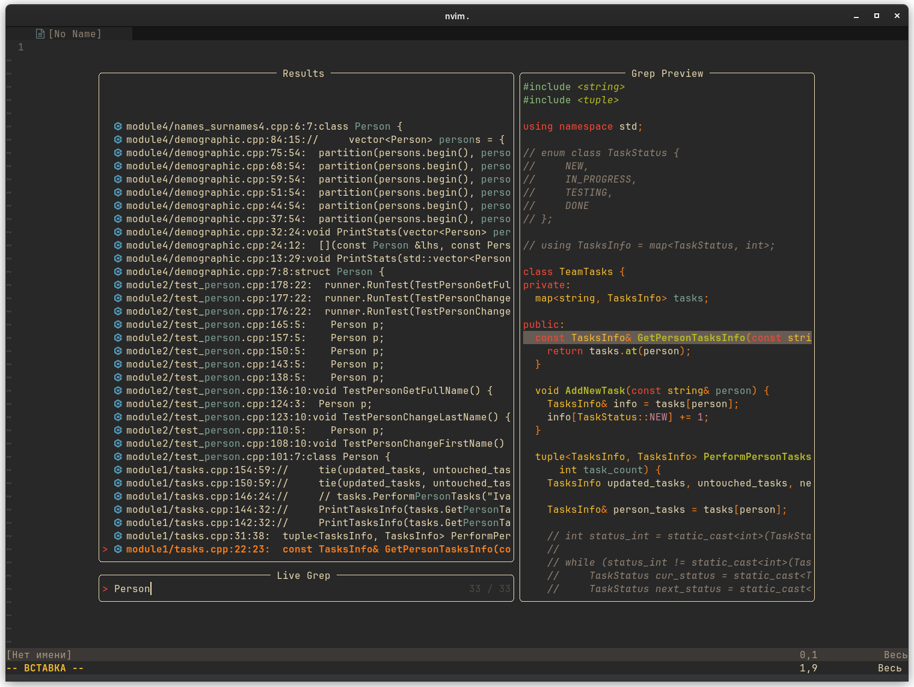
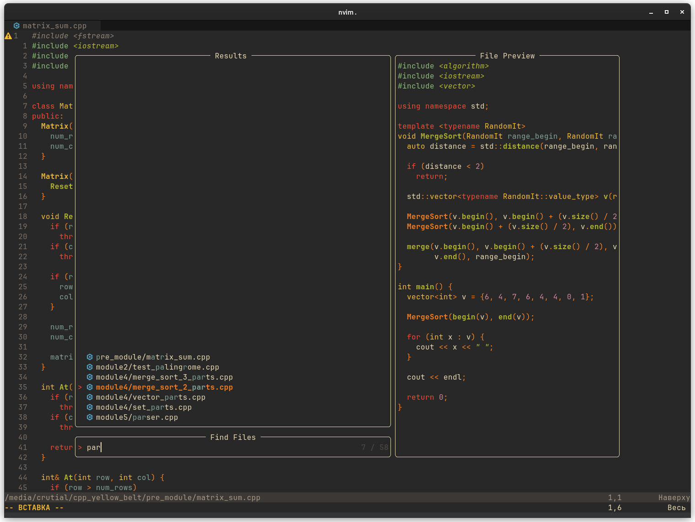

# NVIM

[Скачать](https://github.com/neovim/neovim/wiki/Installing-Neovim)

## Установка
```sh
tar zxvf nvim-linux64.tar.gz --strip-component 1 -C /usr/local/
```

## Используемые плагины

<ol>
    <li>https://github.com/numToStr/Comment.nvim</li>
    <li>https://github.com/nvim-treesitter/nvim-treesitter</li>
    <li>https://github.com/nvim-neo-tree/neo-tree.nvim</li>
    <li>https://github.com/navarasu/onedark.nvim</li>
    <li>https://github.com/ellisonleao/gruvbox.nvim</li>
    <li>https://github.com/williamboman/mason.nvim</li>
    <li>https://github.com/williamboman/mason-lspconfig.nvim</li>
    <li>https://github.com/neovim/nvim-lspconfig</li>
    <li>https://github.com/hrsh7th/cmp-nvim-lsp</li>
    <li>https://github.com/hrsh7th/cmp-buffer</li>
    <li>https://github.com/hrsh7th/cmp-path</li>
    <li>https://github.com/hrsh7th/cmp-cmdline</li>
    <li>https://github.com/hrsh7th/nvim-cmp</li>
    <li>https://github.com/hrsh7th/cmp-vsnip</li>
    <li>https://github.com/hrsh7th/vim-vsnip</li>
    <li>https://github.com/lewis6991/gitsigns.nvim</li>
    <li>https://github.com/glepnir/dashboard-nvim</li>
    <li>https://github.com/nvim-telescope/telescope.nvim</li>
    <li>https://github.com/stevearc/aerial.nvim</li>
    <li>https://github.com/nvimtools/none-ls.nvim</li>
</ol>

### Formatters

Для C\C++ - [astyle](https://astyle.sourceforge.net/). 

Для Python - [black](https://github.com/psf/black)

Для Go - [gofmt](https://pkg.go.dev/cmd/gofmt)

Настройка в файле [none-ls.lua](https://github.com/pzverr/dotfiles/blob/main/config/nvim/lua/plugins/none-ls.lua)

## Скриншоты

[Плагин](https://github.com/nvim-neo-tree/neo-tree.nvim)



[Плагин](https://github.com/williamboman/mason.nvim)



[Плагин](https://github.com/folke/lazy.nvim)



### LSP для python, golang, C\C++




### Fuzzy Finder

[Плагин](https://github.com/nvim-telescope/telescope.nvim)



